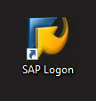
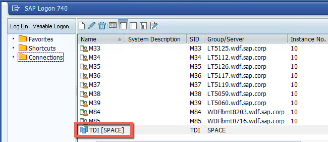
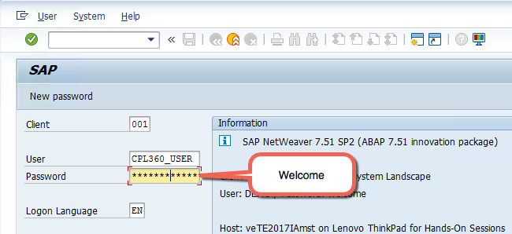
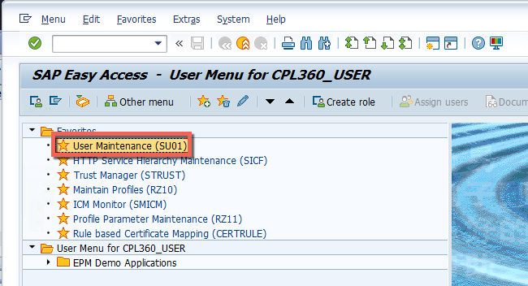
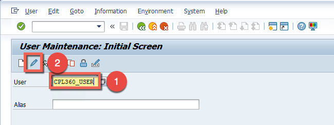
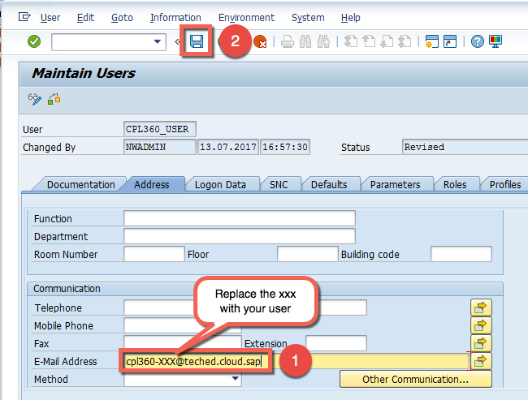
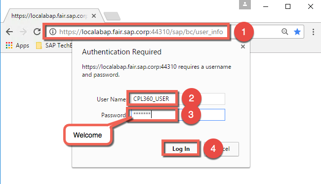
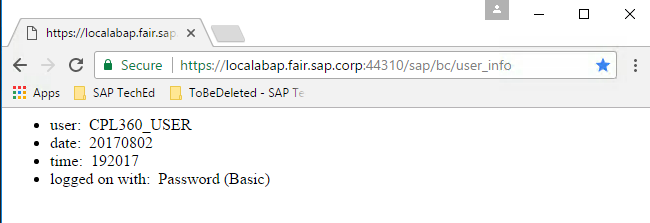

# Exercise A1: Exploration of the backend system and update of the user details
 
#### Objective
In this exercise, you will first explore the backend system that run on an on-premise SAP S/4HANA backend system in the corporate network. An ICF service called “user_info” has been already created and it will be consumed by the cloud application. You will also add a new email address to the user CPL360_USER.

#### Estimated time
3 minutes
 
 

## Step-by-step guide
1. On the desktop of your student laptop double-click on **SAP Logon**.  
    

1. Double-click on list item **TDI** to log on to the TDI SAP S/4HANA on-premise backend system.  
    

1. Enter `CPL360_USER` in the User box. Confirm your entry by pressing the Tab key. Enter `Welcome` in the Password box. Confirm by pressing the Enter key.  
    

1. First we want to add an email address to the user. Double-click on the bookmark called **User Maintenance (SU01)** to edit the details of your user.  
    

1. Insert `CPL360_USER` as **User** name and click on the edit icon.  
    

1. Add the email address provided on your **student overview paper**, for example `cpl360-XXX@teched.cloud.sap` where XXX should be replaced with your user number. Then save the changes by clicking on the **Save** icon.  
    

1. For testing purpose, we have prepared an ICF service called **user_info**. By calling it, you will get the following information:
  - user name
  - date of the request
  - time of the request
  - authentication type  
You can test the service by calling the URL https://localabap.fair.sap.corp:44310/sap/bc/user_info in the browser. Obviously you will need to provide the credentials `CPL360_USER` / `Welcome`.  
      

Here is the result.  
      

## Optional part
Here are the steps to get more details about the service:
- Double-click the bookmark called **HTTP Service Hierarchy Maintenance (SICF)**.
- Keep `SERVICE` as **Hierarchie Type** and click on the icon **Execute**.
- Under **Virtual Hosts / Services** expand the path **default_host** > **sap** > **bc**.
- Double-click on **user_info** to see the details about the service.
- For instance click on **Logon Data** to see the **Logon Procedure List**.
