# Exercise A3: Configuration of SAP Cloud Platform Connectivity and deployment of a cloud application

#### Objective
In this exercise, you will logon to your SAP Cloud Platform trial subaccount and you will create a HTTP destination in your SAP Cloud Platform Cockpit. This destination will point to the on-premise backend service via the Cloud Connector. Then you will deploy a simple JAVA application that will consume this destination. As we are first using **Basic Authentication** to access the backend system, you will first add the credentials of the backend user in the destination.

#### Estimated time
10 minutes
 
 

## Step-by-step guide
1. In your web browser open URL https://account.hanatrial.ondemand.com/ and press the **Log On** button to log in to your SAP Cloud Platform trial subaccount.  
    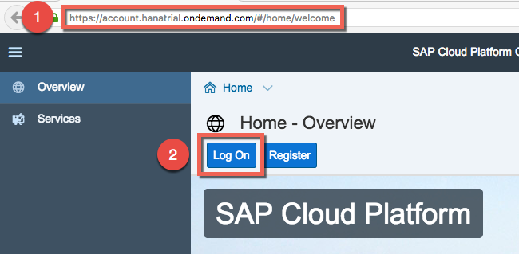

1. Login with the credentials provided on your **Student Overview Paper**. Use the Subaccount Name e.g. `p-xxxxxxxxxx` and `Welcome17` as Password.  
    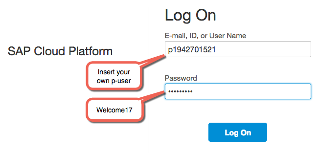

1. Click the link **pXXXXXXXXXXtrial** to enter your personal developer subaccount on the SAP Cloud Platform trial landscape.  
    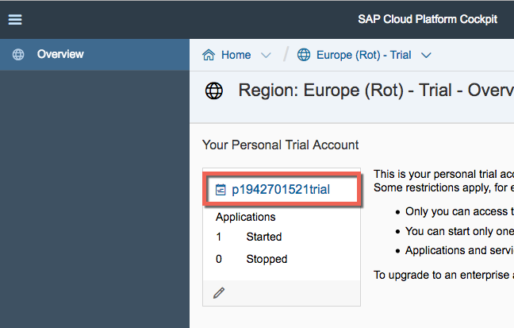

4. Check now under **Connectivity** > **Cloud Connectors** whether you can see the on-premise system as **Exposed Back-End Systems**.  
    

1. Go now to the tab **Destinations**. Then click on **New Destination**.  
    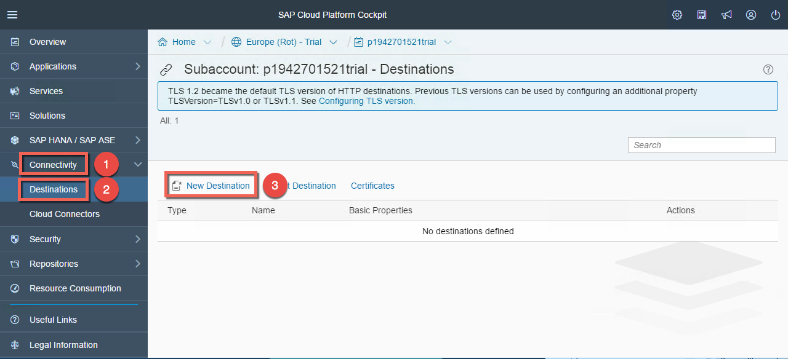

1. Configure the destination with the following details:
    - Name: `ABAP_SYSTEM`
    - Type: `HTTP`
    - Description: `Destination to my local ABAP system`
    - Location ID: leave it empty
    - URL: `http://virtualbackend:1234` (virtual host and virtual port defined in the Cloud Connector)
    - Proxy Type: `OnPremise`
    - Authentication: `BasicAuthentication`
    - User: `CPL360_USER`
    - Password: `Welcome`

1. Press the **Save** button.  
    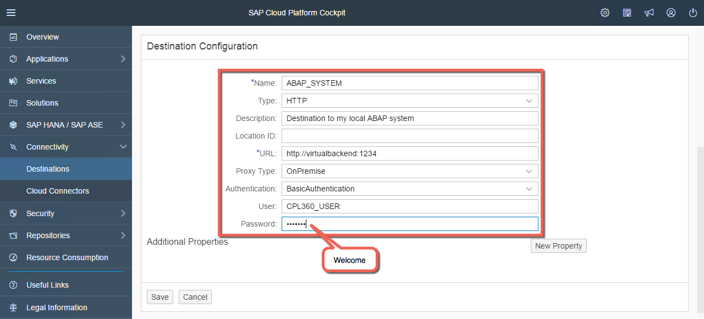

1. Test the destination by clicking on **Check Connection** and verify that the connection is successful. Be aware that the **Check Connection** function only checks the successful HTTP tunnel connection between Cloud Connector and SAP Cloud Platform. But it does **_NOT_** check the service authentication with the (possibly incomplete or wrong) user credentials!  
    

    > Note: if you encounter any problem with the configuration, you can alternatively import the destination called **A3_ABAP_SYSTEM.properties** available in the **Student Share** folder. Click on the **Import Destination** button and choose the properties file to be imported. Then press the **Save** button.

1. Now that we have everything in place, let's deploy a simple cloud application that consume the backend service. Go to Applications in the SAP Cloud Platform Cockpit and click on **Java Applications**. Then press the button **Deploy Application**.  
    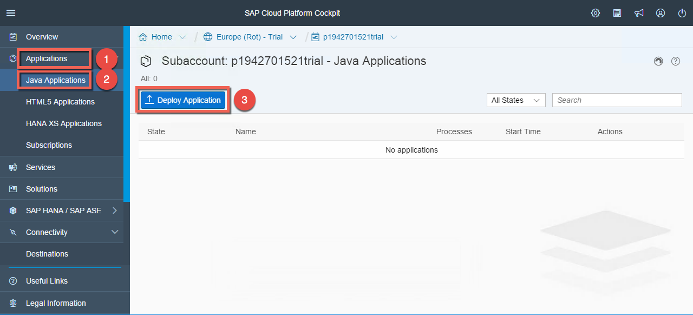

1. Click on **Browse** to select the war file called **A3_DemoPrincipalPropagation.war** in the folder **CPL360** of your **Student Share**. Then press the button **Open**.  
    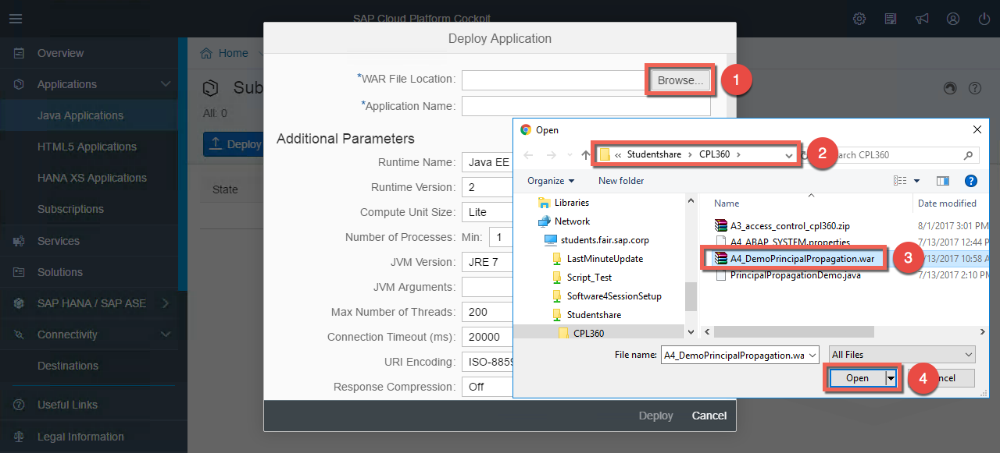

1. Keep all the settings as it is and click **Deploy** to finalize the deployment.  
    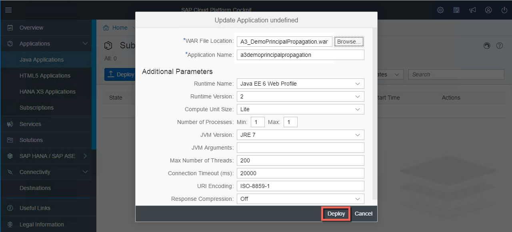

1. In the notification popup, click **Start** to launch the application.  
    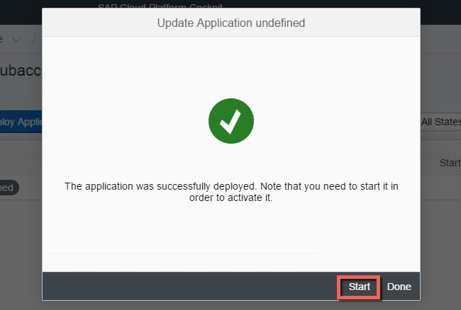

1. It will take 1 or 2 minutes to start a server for the Java application. So in the meanwhile, you can have a look at the code of the application by opning the following URL: https://github.wdf.sap.corp/Connectivity-CF-PM/CPL360/blob/master/code/PrincipalPropagationDemo.java. Here you can see that we have defined the destination **ABAP_SYSTEM** as default and that we are appending the path **/sap/bc/user_info**. Then the response will be displayed in the browser. We are using here a very simple application as the focus of this session is on setting up the connectivity and should not be distracted by a fancy UI.  
    

1. Once it's started, click on the name of the application.  
    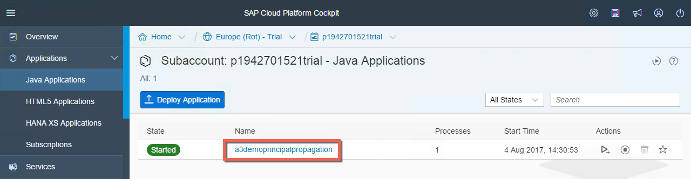

1. Then click on the Application URL to start the cloud application in the browser.  
    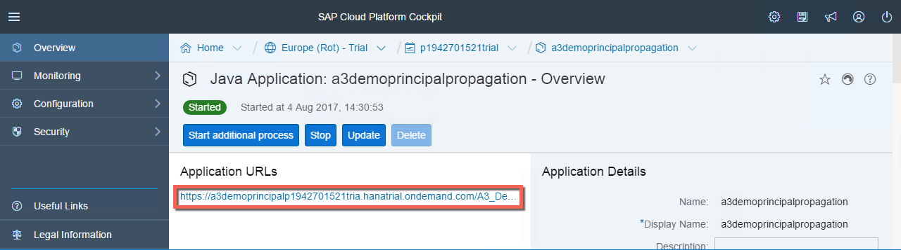

1. The request will be sent to the Cloud Connector with the credentials saved in the destination. First the Cloud Connector will check if the resource is available in the access control and then the request will be sent to the backend system. You should at the end see the following result.  
    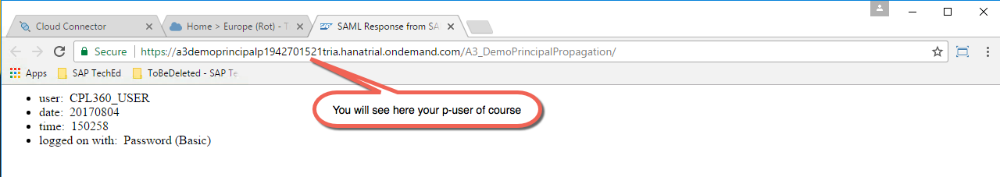
