# Exercise B1: Configuration of the Cloud Connector for principal propagation

#### Objective
In this exercise, you will learn how to configure the Cloud Connector in order to propagate the user identity from the cloud application to the backend system. For this purpose, 3 different steps are mandatory: set up a trust with the cloud identity provider, export the system certificate for acquainting it with the on-premise backend, and configure the CA certificate of the Cloud Connector. At the end of the exercise you will also change the pattern used for the propagation and create a sample certificate in order to import it in the backend.

#### Estimated time
20 minutes
  

## Step-by-step guide
1. First you will update the **Access Control** created previously in the exercise A3. Click on **Cloud To On-Premise** and click on Edit icon.  
    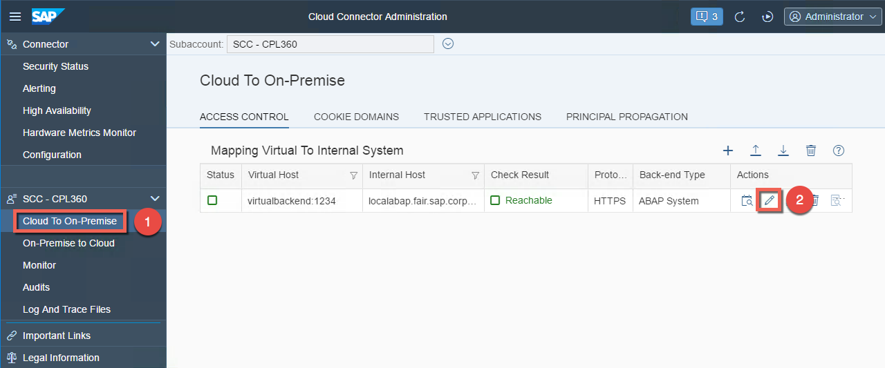

1. Change the **Principal Type** to `X.509 Certificate`and click **Save**.  
    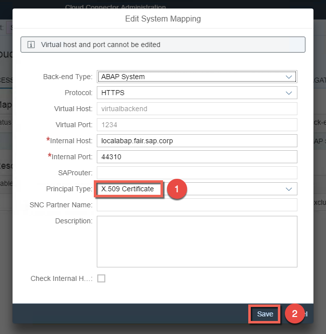

1. After saving the changes, 3 messages will appear in the notification center (visible on the top of the screen). Click on the icon of the notification center to see which steps are now required:
    - CA certificate
    - System certificate
    - Trust configuration 
  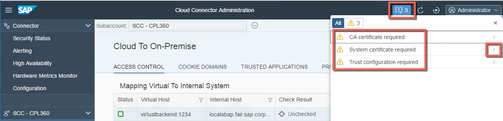

1. For more details, click on each of the steps in the popup.   
    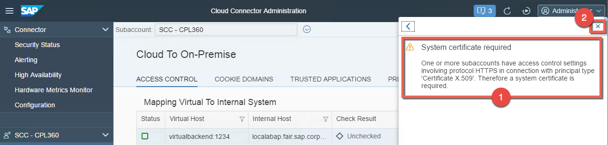

The rest of the exercise will be strucured based those 3 required steps.  

### Step 1: Trust configuration to establish trust with the identity provider.
By default, your Cloud Connector is not trusting any entity that is issuing tokens for principal propagation. Therefore, the list of trusted identity providers is empty in the beginning. If you decide to make use of the principal propagation feature, you need to establish trust to at least one identiy provider. Currently, SAML2 identity providers are supported as external entitiy. Trust to one or more SAML2 IDPs can be configured per subaccount. Further possible entities are the applications available in the subaccount of the Neo environment.

1. Go to **Cloud To On-Premise** and click on the tab **PRINCIPAL PROPAGATION**. Then Press the **Synchronize** button.  
    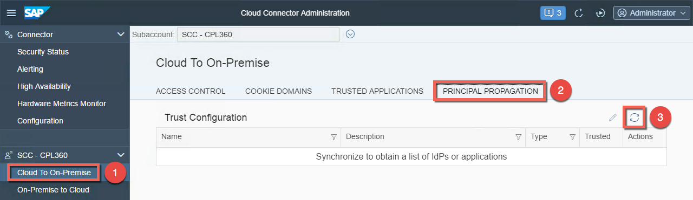

1. The list of existing identity providers will be stored locally in your Cloud Connector and **SAP ID Service** is selected per default. Morevover the notification center is updated and you should see now only 2 steps required.
  
    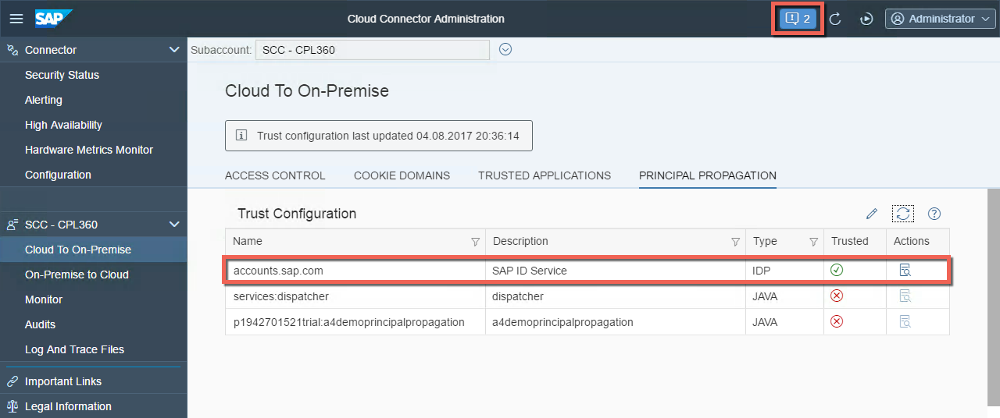
  

### Step 2: Setup System Certificate
Now you need to set up the system identity of the Cloud Connector so that you are able to establish trust with the back-end system. In the case of HTTPS communication, this is done with a client certificate during an SSL handshake. You have the following different options to create a certificate for your Cloud Connector:

* Copy your existing UI Certificate
* Self-signed
* Import new certificate 

The first option is attractive as you need only 1 certificate for the UI and the system. Thus you can save costs ;)
In our scenario we will re-use the existing UI certificate. At the end of step 2, we will export and prepare the certificate to identify the Cloud Connector later on in the backend system.

1. Go to **Configuration**, select the tab **ON PREMISE** and scroll to the section System Certificate. Press the **Copy UI Certificate** button in order to generate a system certificate.  
    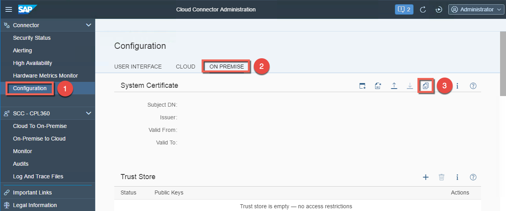

1. Click **OK** to confirm the creation of the certificate.  
    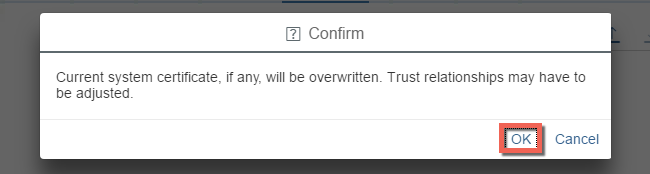

1. Check the result of the import and export now the system certificate, so that we can import it later on in the backend.  
    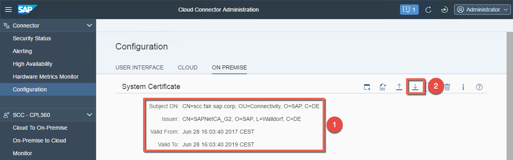

1. Let's prepare the exported certificate (This step is not needed if it's self-signed). Open the **Downloads** folder and double-click on the file called **sys_cert.der**.   
    

1. In the popup window, go to the tab **Certification Path** and double-click on **SAPetCA_G2**.   
    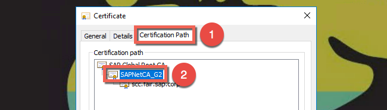

1. A second popup window will open. Go to the tab **Details** and press the button **Copy to File...**.   
    

1. Click **Next**.   
    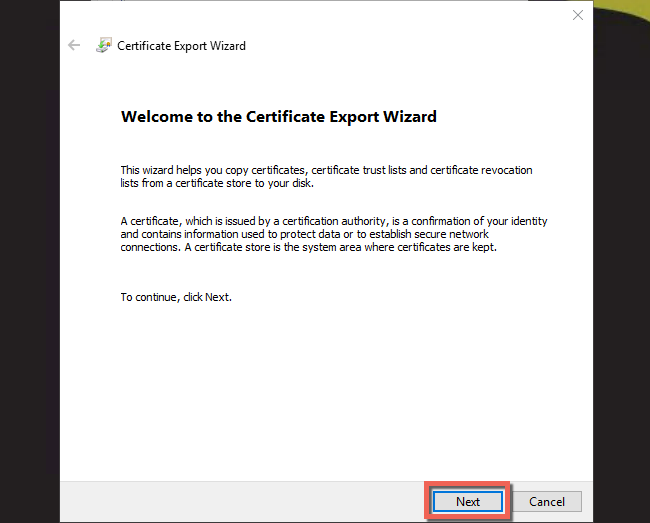

1. Click **Next**.   
    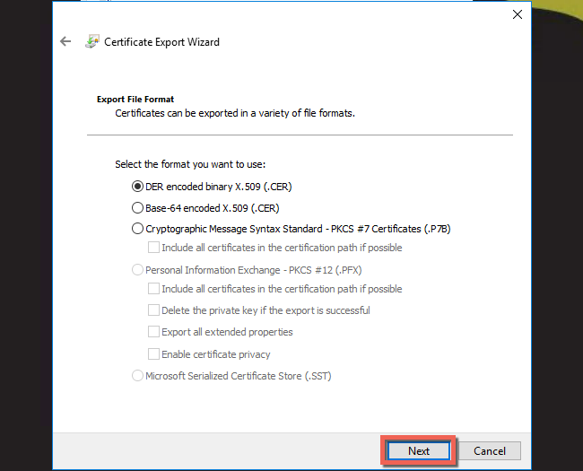

1. Press the button **Browse** and select **Downloads** as location for the file to export. Name the file `cacert.der` and press the button **Save**.   
    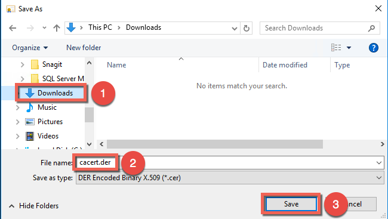

1. Click **Next**.  
    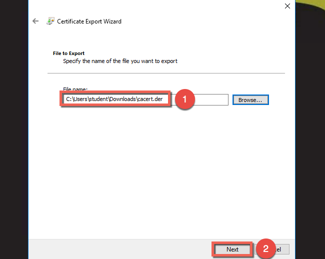

1. Click **Finish**.  
    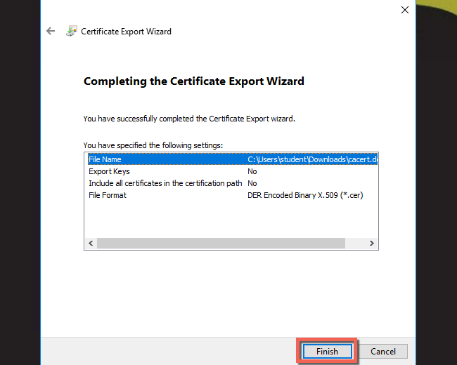

1. Rename the file from `cacert.der.cer` to `cacert.der`.  
    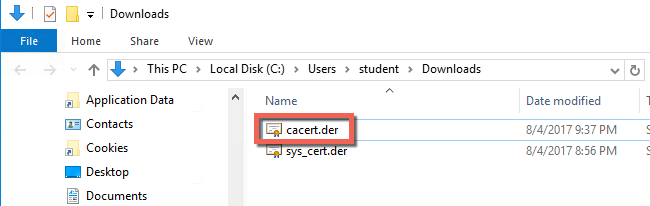

1. Check the notification center that you have now only 1 step required.  
    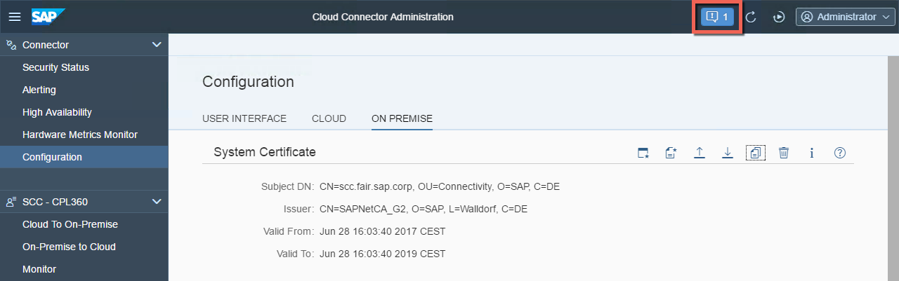
  

### Step 3: Setup CA Certificate
In order to use principal propagation you need to allow the Cloud Connector to propagate the user accordingly. In the case of HTTPS, the Cloud Connector will forward the true identity in a short-living X.509 certificate in an HTTP header named SSL_CLIENT_CERT. The backend system needs to use this certificate for logging on the real user.

You can enable support for Principal Propagation with X.509 certificates in two ways:

* Using a Local CA in the Cloud Connector
* Using a Secure Login Server and delegate the CA functionality to it.

In the exercise you will use the first approach for issuing short-living certificates.

1. Go to Configuration, Tab OnPremise, section CA Certificate + Click on icon to create a self-signed (typical self-signed for CA).   
    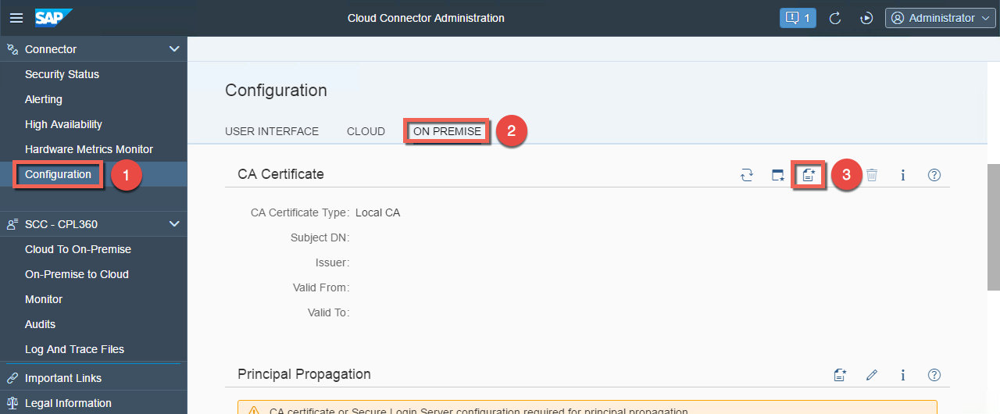

1. Insert the following details in the form and click **Create**.
    - CN: `CloudConnector`
    - OU: `Connectivity`
    - O: `SAP`
    - ST: `Bayern`
    - C: `DE`  
    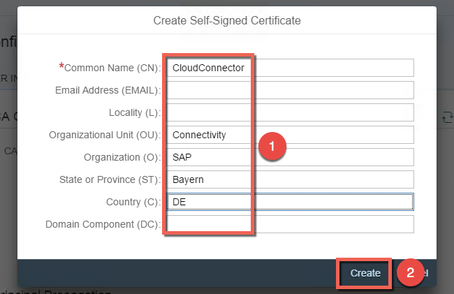

1. After creating the CA certificate successfully, you should see its distinguished name, the name of the issuer, and the validity dates. Notice also that the icon of the notification center has disappeared.  
    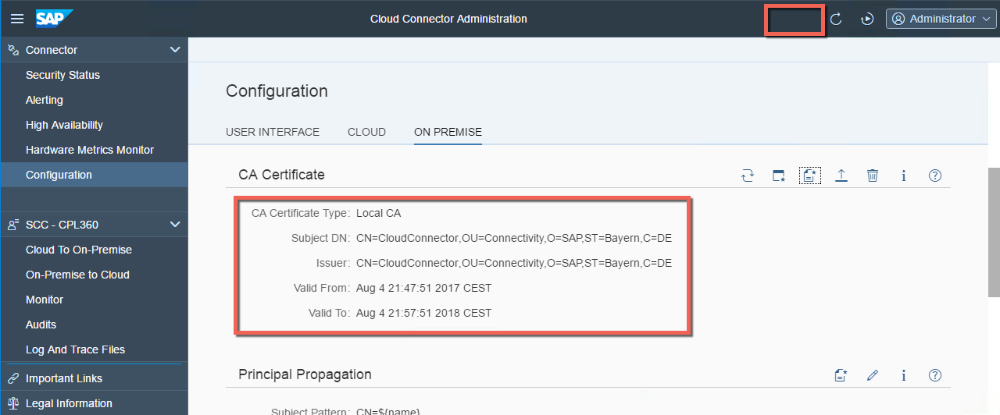
  

### Step 4: Configure a subject pattern for principal propagation
Using principal propagation, you can define the pattern to identify the user for the subject of the generated short-living X.509 certificate, as well as its validity period. In the exercise, you will setup the email as login detail.
In addition to that you will generate a sample certificate that looks like one of the short-living certificates created at runtime. It will be used later on for generating user mapping rules in the target system.

1. Go to **Configuration**, select the tab **ON PREMISE** and scroll to the section **Principal Propagation**. Then click the **Edit-icon** to change the subject pattern.  
    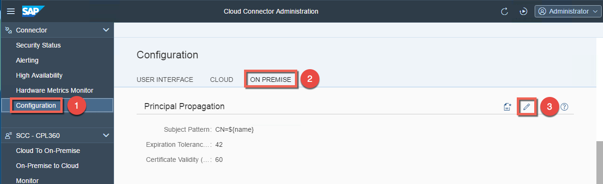

1. Add following details and click **Save**.
    - CN: `${name}`
    - EMAIL: `${mail}`
    - O: `SAP`
    - C: `DE`  
  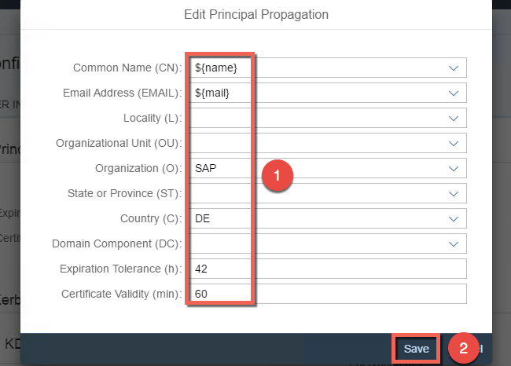

1. Verify that the pattern has been updated and create a sample certificate by clicking on the **Create-icon**.  
    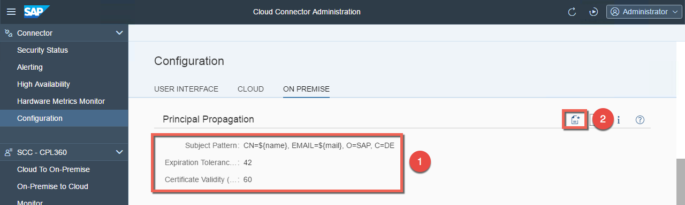

1. Add following details and press the button **Generate**.  
    - CN name: `pXXXXXXXXXX`(p-user of your Cloud Platform Subaccount e.g. p1942701521)
    - Email: `cpl360-XXX@teched.cloud.sap` (replace the XXX with your user number e.g. cpl360-001@teched.cloud.sap)  
    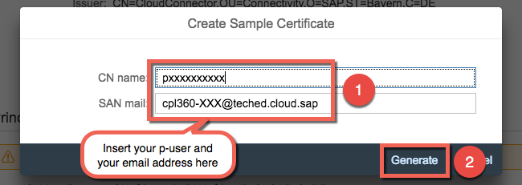

1. Check in the folder **Downloads** that a file **scc_sample_cert.der** has been created.  
    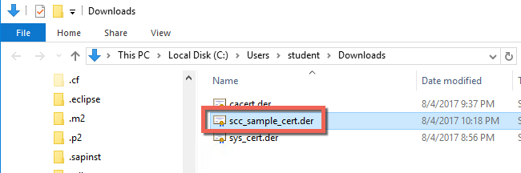
