# Exercise B2: Configuration for principal propagation in the backend system 

#### Objective
In this exercise, you will learn how to configure the target system in a way that it trusts the Cloud Connector and you will import the previously created sample certifcate in order to generate a user mapping rule in the ABAP system.

#### Estimated time
20 minutes
  

## Step-by-step guide
There are two levels of trust:
    - you need to allow the Cloud Connector to identify itself with its system certificate for the HTTPS case.
    - you need to allow this identity to propagate the user accordingly so that the short-living X.509 certificate could be forwarded.
At the end of the exercise you will configure the user mapping in the target system. The X.509 certificate contains information about the cloud user in its subject. You will use this information in order to map the identity to the appropriate user in this system.

## Step 1: Establishing trust between the ABAP System and the Cloud Connector by importing CA issuing the system certificate
1. Go to you backend system and click on the bookmark called **Trust Manager (STRUST)** in the favorites.  
    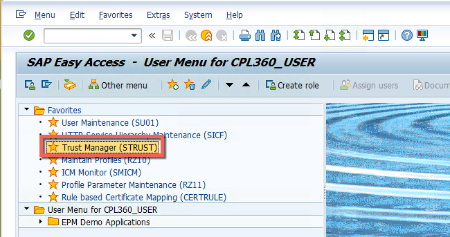

1. Click on "SSL server Standard".  
    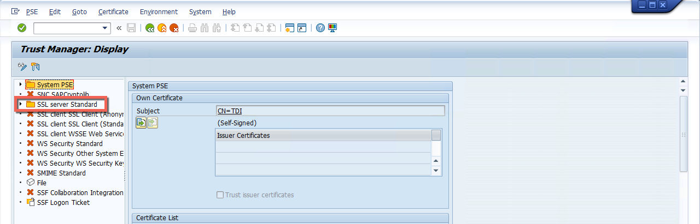

1. Switch to edit modus by clicking the **Edit-icon**.  
    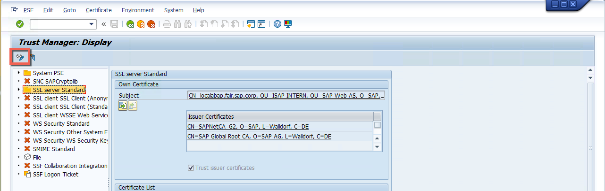

1. Click on the **Import certificate** icon at the bottom of the screen.  
    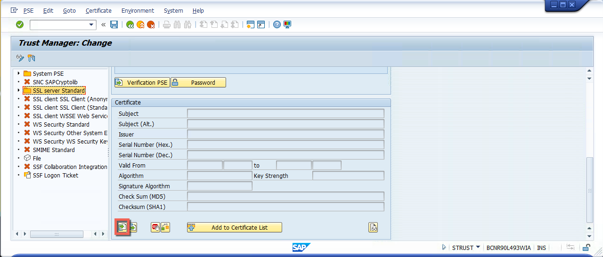

1. In the dialog window, choose the certificate file representing the public key of the issuer of the system certificate. The path of the certificate should be `C:\Users\student\Downloads\cacert.der` if you followed the previous exercises.  
    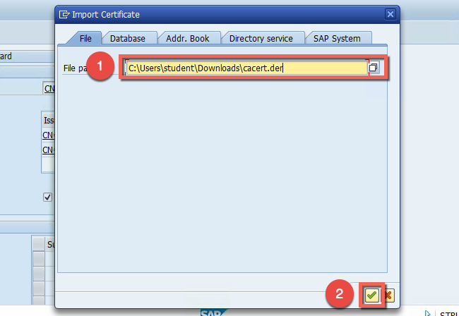

1. Then grant access by pressing on the button **Allow**.  
    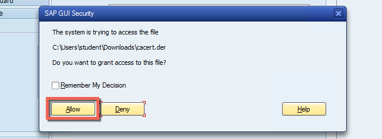

1. All the details of the certificate are now displayed. Press then the button **Add to certificate list**.  
    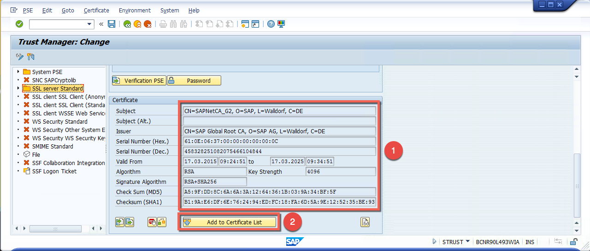

1. Verify that you can see your system certificate in the **Certificate list**. Then **Save** the configuration.  
    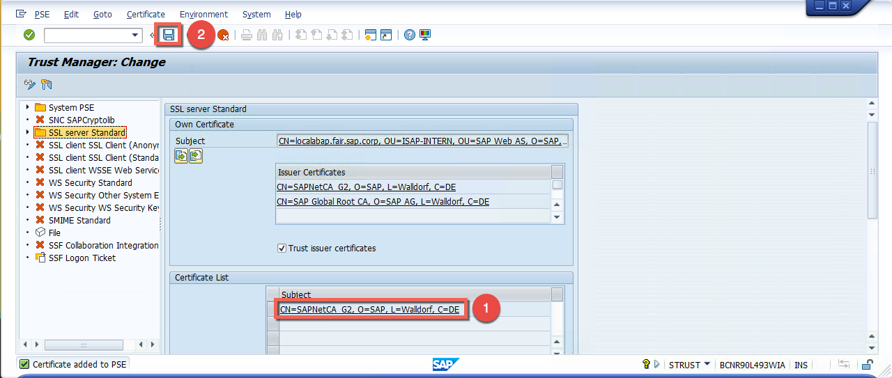

1. Click the **Back** icon.  
    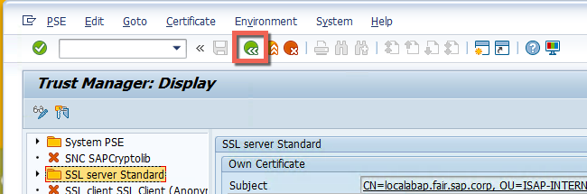
  

## Step 2: Configuration of the ICM
> Note: The Internet Communication Manager (ICM) ensures that communication between the SAP System and the outside world via HTTP, HTTPS and SMTP protocols works properly. In its role as a server, the ICM is processing requests from the Internet that arrive as URLs with the server/port combination that the ICM is listening to. The ICM then calls the relevant local handler for the URL in question.

1. Click on the bookmark called **Maintain Profiles (RZ10)** in the favorites.  
    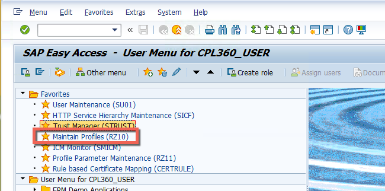

1. The system has been installed on a master image and the profile has been bound to the name of the system. As you are using now a clone of the image, we need first to adapt the profile. So click **Utilities** in the top menu and select **Import profiles** - **Of active servers**.  
    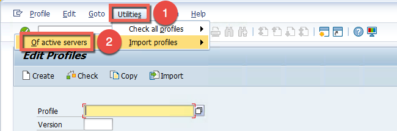

1. Check that the profile bound to your system name has been added and click the **Back** icon.  
    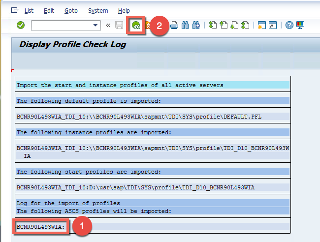

1. Now you can continue with with the standard procedure and select **DEFAULT** as profile.  
    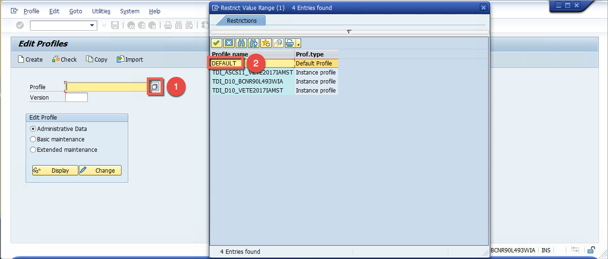

1. Select the radio button for **Extended maintenance** and press the **Change** button.  
    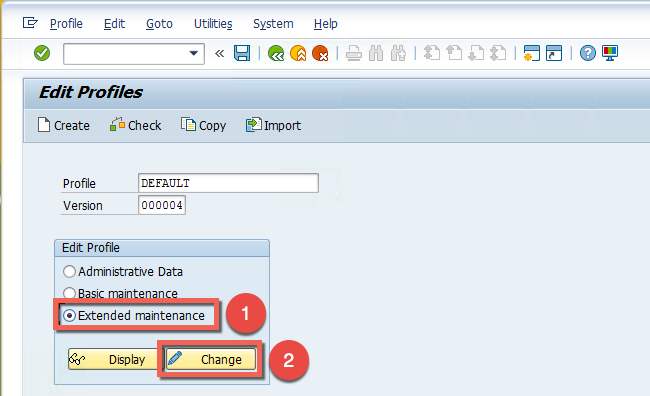

1. Press the button **Parameter** to add new one.  
    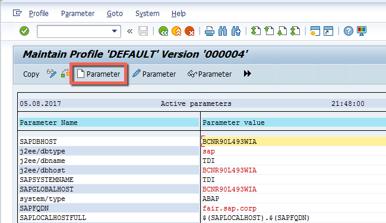

1. Add following details:
    - Parameter name: `icm/HTTPS/trust_client_with_issuer`
    - Parameter val.: `CN=SAPNetCA_G2,  O=SAP, L=Walldorf, C=D`  
    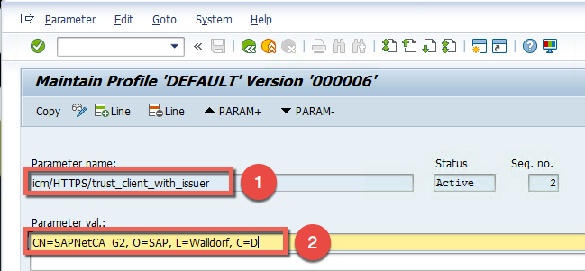  

    > Note: You have probably seen that the last letter of the parameter value is missing. Please keep it without "E" at the end. We do want to debug the application in the next lesson.  

1. Hint: usually you will find the issuer of the system certificate in the Cloud Connector Administration UI under **Configuration** > **ON PREMISE** > **System Certificate**.  

1. Click the **Back** icon.  
        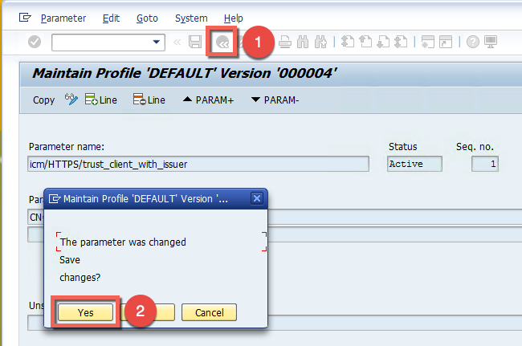

1. You should see the parameter displayed.  
      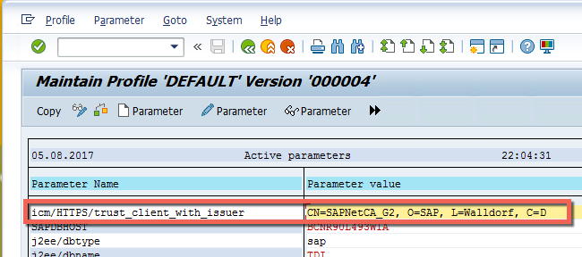

1. Now you should do the same procedure to add the second parameter which is the subject of the system certificate. Here are the details:
    - Parameter name: `icm/HTTPS/trust_client_with_subject`
    - Parameter val.: `CN=scc.fair.sap.corp, OU=Connectivity, O=SAP, C=DE`  

1. Hint: usually you will find the issuer of the system certificate in the Cloud Connector Administration UI under **Configuration** > **ON PREMISE** > **System Certificate**.  
    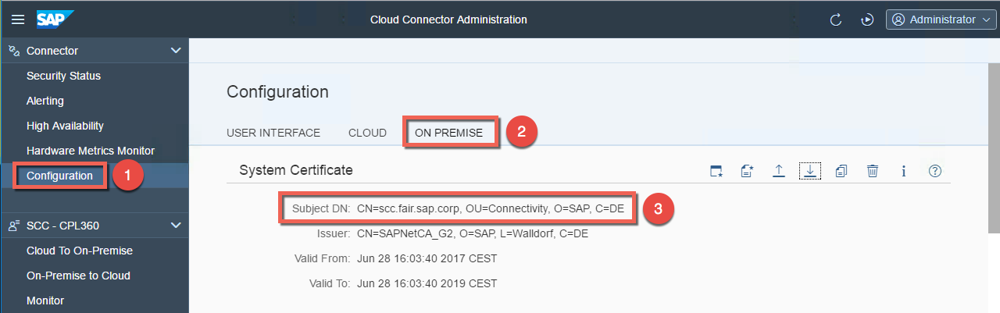

1. After you see both parameters listed, press the **Back** icon.  
      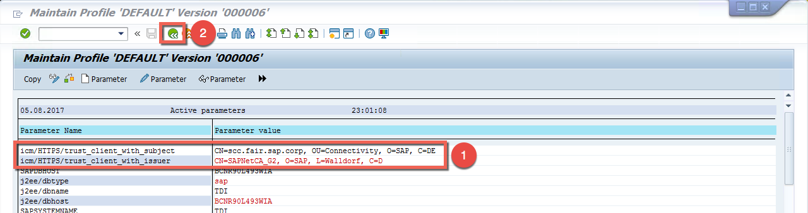

1. Click **Yes** in the popup window to update the profile.  
      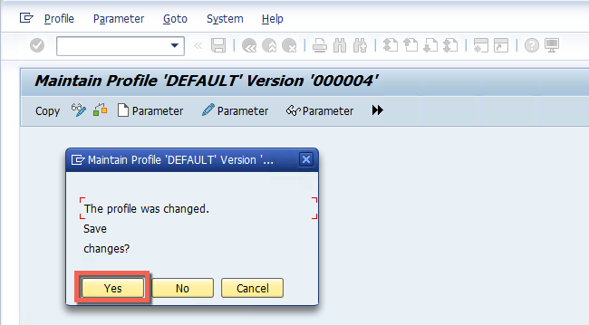

1. Click the **Save** icon to activate the profile.  
  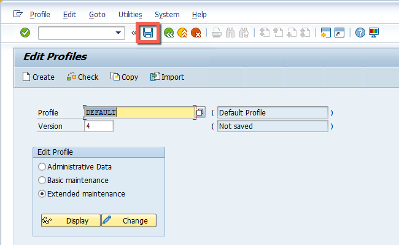

1. Confirm the activation by clicking on **Yes**.  
  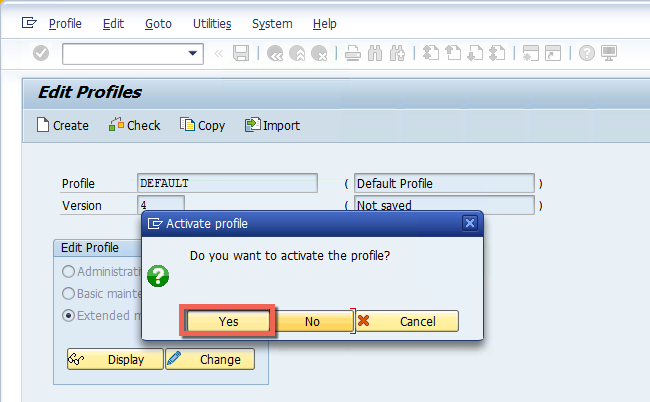

1. Close the information popup window by clicking the **Green Check** icon.  
  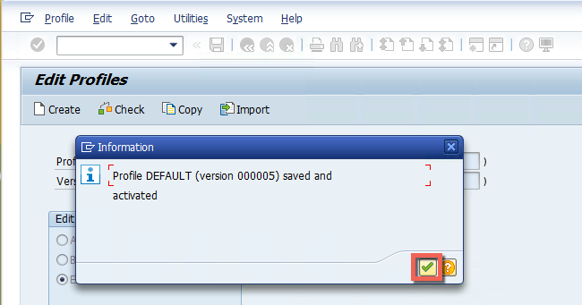

1. In the next information popup, you will be informed that the ICM needs to be restarted. Click on the **Green Check** icon.  
  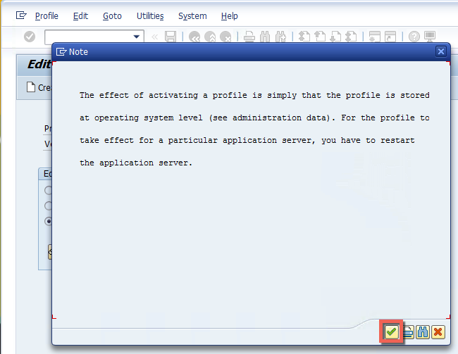

1. Click the **Back** icon.  
  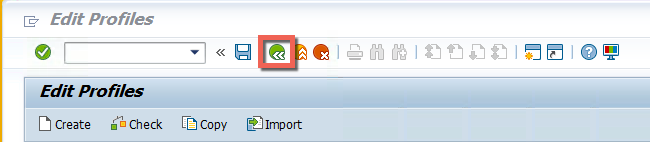

1. Open the ICM by clicking the bookmark called **ICM Monitor (SMICM)** in favorites.  
    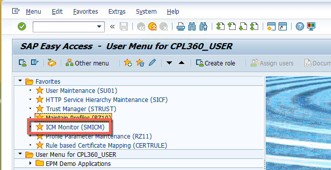

1. Restart the ICM by clicking **Administration** in the top menu and select **ICM** > **Hard Shut Down** > **Global**.  
    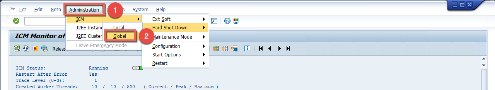

1. Confirm the restart by clicking **Yes** in the popup window.  
    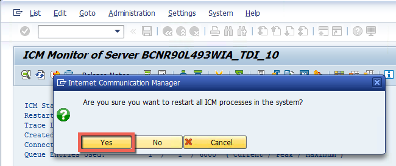

1. Check the HTTPS settings under **Goto** in the top menu. Select **Parameters** > **Display**.  
    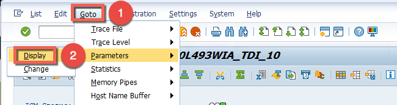

1. The 2 new parameters should be now visible under **HTTPS (SSL) settings**.  
    

1. Click the **Back** icon.  
    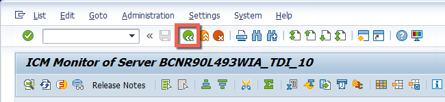
  

## Step 3: Mapping of the short-living certificate
You can do the mapping manually in the system or make use of an Identity Management Solution for a more comfortable approach. For example, for large numbers of users the rule-based certificate mapping is a good way to save time and effort. In this scenario, we will use the second option.

1. Click the bookmark called **Profile Parameter Maintenance (RZ11)** in favorites.  
    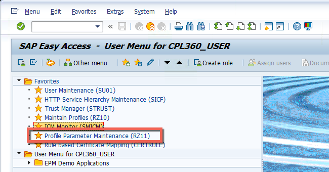

1. Insert `login/certificate_mapping_rulebased` as **Parameter Name** and click `Display`.  
    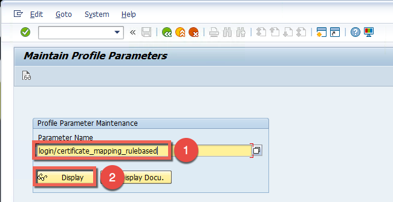

1. Press the button **Change Value**.  
    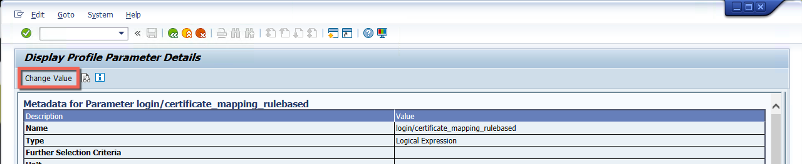

1. Insert `1` as **New Value** and then press the **Save** button.  
    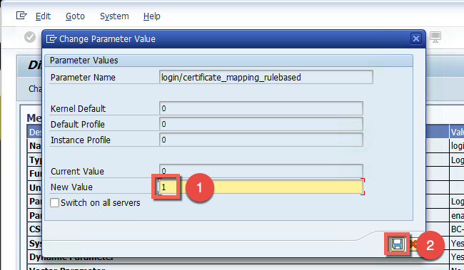

1. Confirm the change by clicking the **Green Check** icon.  
    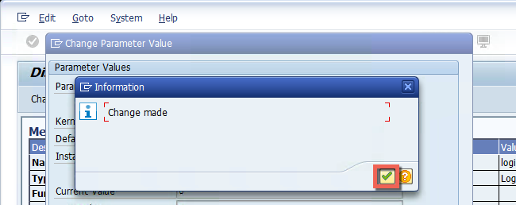

1. Verify the new value and go back to bookmarks by clicking 2 times the **Back** icon.  
    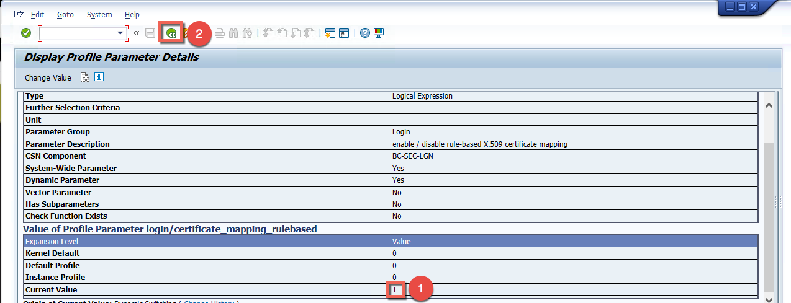

1. Click on the bookmark called **Rule based Certificate Mapping (CERTRULE)** in favorites.  
    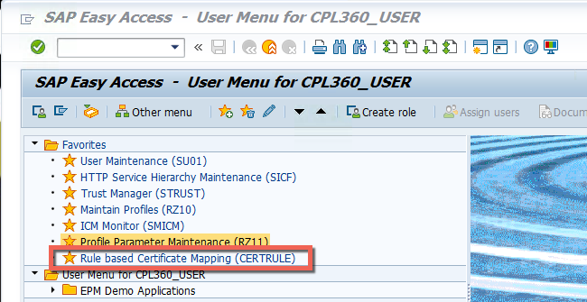

1. Click on the **Display/Change** icon.  
    

1. Import the previously exported sample certificate by clicking on the **Import** icon and click then **Open**.  
    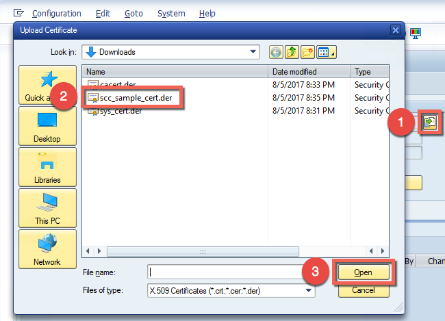

1. Grant access by clicking on **Allow**.  
    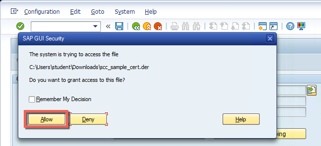

1. Press the button **Rule**.  
    

1. Update the following details and click the **Enter** icon:
    - Certificate Attr: `1.2.840.113549.1.9.1=te2017_cpl360-XXX@teched.cloud.sap` (where XXX should be replaced with your user number)
    - Login as: `E-Mail`  
    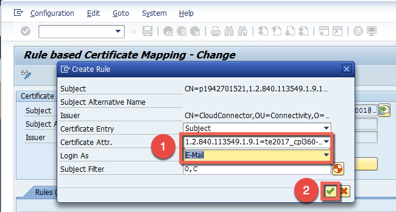
        > Note: Here you can see that there is no standardized display of subject attributes. Cloud Connector is displaying the attribute as EMAIL, Windows OS as E, and the CERTRULE screen has no textual represenation at all, but only shows the OID. This is also a common pitfall when establishing trust as often a textual representation has to be provided.  
        
1. Verify that the rule has been added and press the **Save** to activate it.  
    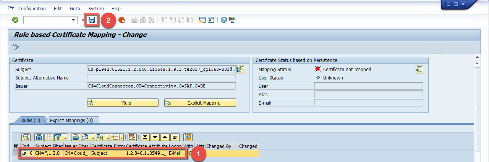

1. Check now that the user **CPL360_USER** is mapped in the right panel called **Certificate Status based on Persistence**.  
    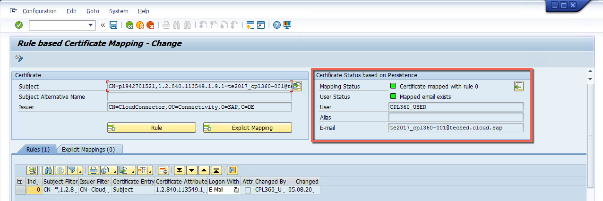
