# Exercise C2: Debugging in the ABAP backend system

#### Objective
In this exercise, you will learn how to debug in the backend system a non-working cloud application consuming resources from this backend system. You will configure the traces in the ICM, find the problem in the logs and then update the ICM so that the cloud application works again.

#### Estimated time
15 minutes
  

## Step-by-step guide
1. Go to the ABAP system **TDI** and open the ICM by clicking the bookmark called **ICM Monitor (SMICM)** in the favorites.  
    

1. Then click in the top menu on **Goto** > **Trace Level** > **Increase**.  
    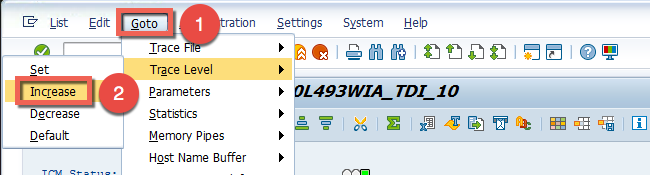

1. Verify that trace level is on **2**.  
    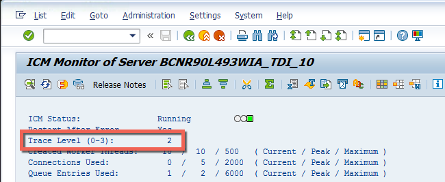

1. Reset the trace file by clicking in the top menu on **Goto** > **Trace File** > **Reset**.  
    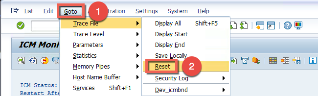

1. Confirm to reset the trace file by pressing the **Yes button**.  
    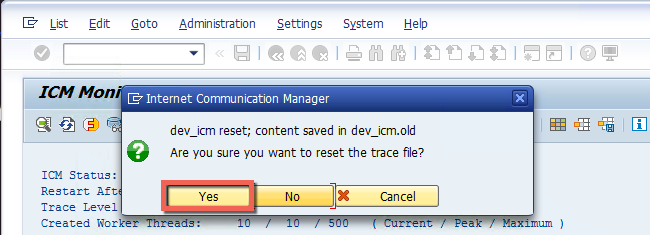

1. Go to the browser and click the **Refresh** icon to send again the request from the cloud application.  
    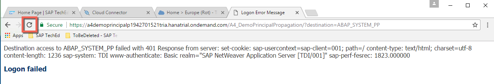

1. Go back to the backend system and click in the top menu on **Goto** > **Trace Level** > **Decrease** and verify that the level is now set to **1**.  
    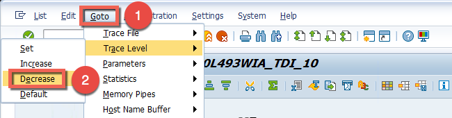

1. Download the logs by clicking in the top menu on **Goto** > **Trace File** > **Save locally**.  
    

1. Save under the default location **Downloads**.  
    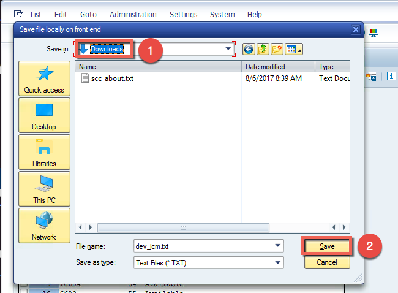

1. Confirm Download by clicking 2 times **Allow** and the **Green Check** icon.  
    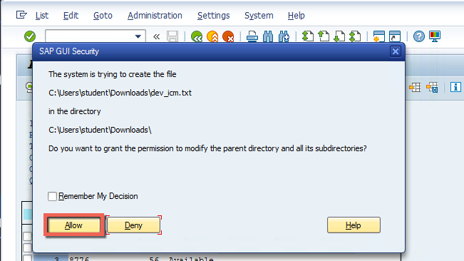  
    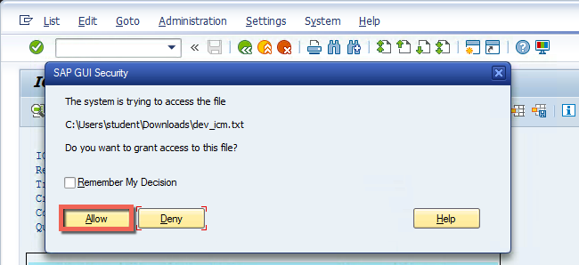  
    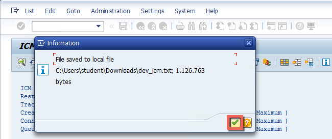  

1. Open the file called **dev_icm.txt** in Notepad++.  
    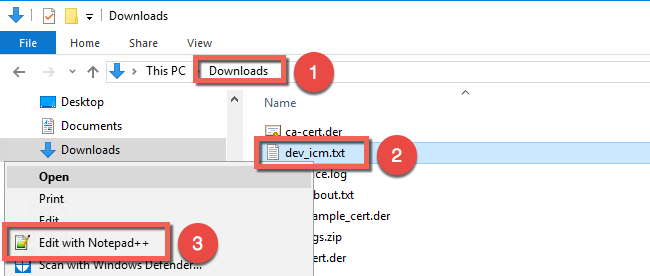

1. Search for "SAPNetCA_G2".  
    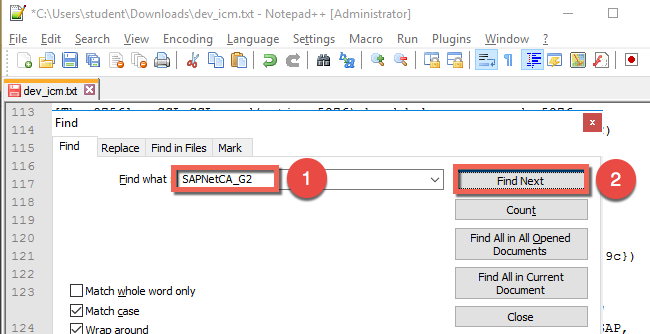

1. Verify that an SSL connection is created.  
    

1. Click **Find Next** and check the "Client certificate".  
    

1. Click **Find Next** and see the error message. The system certificate is not trusted as its issuer does not match the trusted issuer.  
    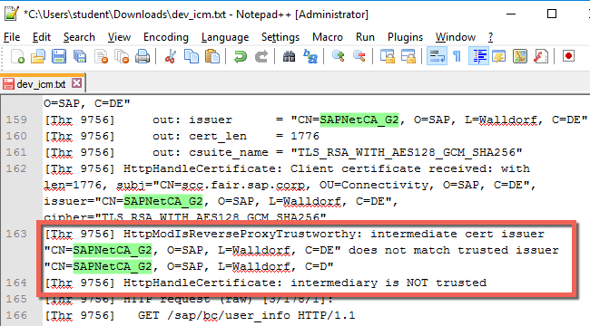

1. Let's solve the problem by correcting the parameter of the issuer in the profile. Click on the bookmark called **Maintain Profiles (RZ10)**.  
    

1. Select the profile **Default** and the radio button for **Extended maintenance**. Then press the button **Change**.  
    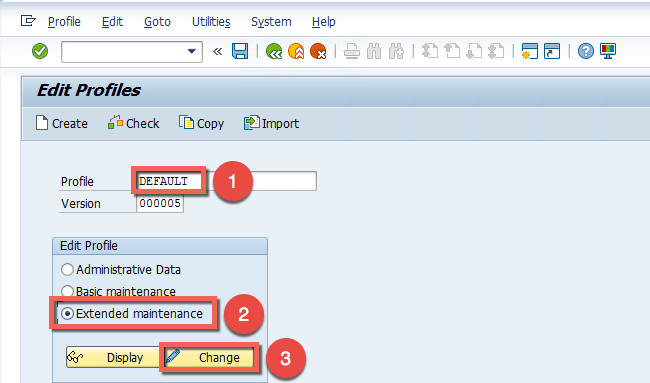

1. Select the parameter **icm/HTTPS/trust_client_with_issuer** and click on **Edit Parameter**.  
    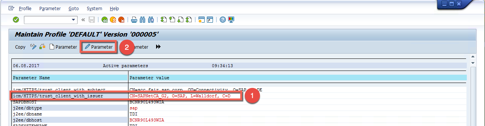

1. Update the parameter value by adding an `E` at the end and click the **Back** icon.  
    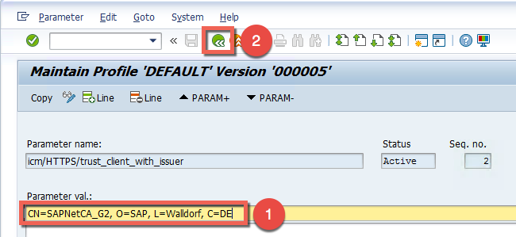

1. Click **Yes** in the popup window to update the parameter.  
    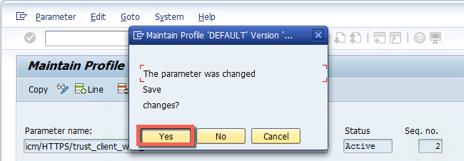

1. Verify the new value of the parameter and click on the **Back** icon.  
    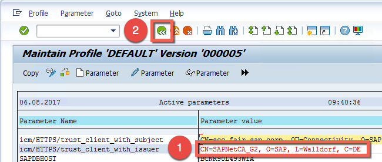

1. Click **Yes** in the popup window to update the profile.  
    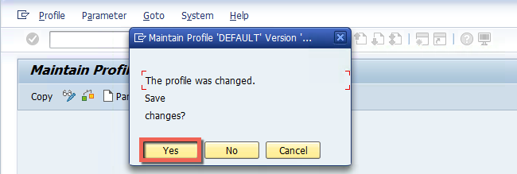

1. Click the **Save** icon to activate the profile.  
    

1. Confirm the activation by clicking on **Yes**.  
    

1. Close the information popup window by clicking the **Green Check** icon.  
    

1. In the next information popup, you will be informed that the ICM needs to be restarted. Click on the **Green Check** icon.  
    

1. Click the **Back** icon.  
    

1. Open the ICM by clicking the bookmark called **ICM Monitor (SMICM)** in favorites.  
    

1. Restart the ICM by clicking **Administration** in the top menu and select **ICM** > **Hard Shut Down** > **Global**.  
    

1. Confirm the restart by clicking **Yes** in the popup window.  
    

1. Check the HTTPS settings under **Goto** in the top menu. Select **Parameters** > **Display**.  
    

1. The new value of the parameter should be now visible under **HTTPS (SSL) settings**.  
    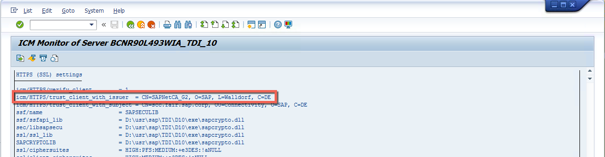

1. Go to the browser and click the **Refresh** icon to send again the request from the cloud application.  
    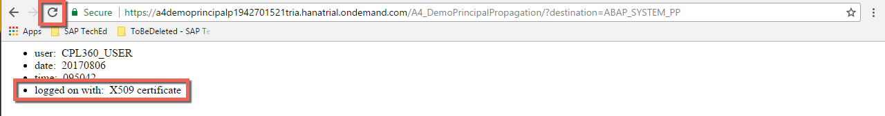

1. Congratulations, the application is now running and you should see **X.509 certificate** as authentication type. The principal propagation has been configured completely, so that the backend user is now identified via his email address.
